<div align="center">

# 📚 Student Course Service

### RESTful Microservice for Course Management

[](https://spring.io/projects/spring-boot)
[](https://spring.io/projects/spring-cloud)
[](https://openjdk.org/)
[](https://www.mysql.com/)
[](LICENSE)

[Features](#-features) • [Architecture](#%EF%B8%8F-architecture) • [Quick Start](#-quick-start) • [API Documentation](#-api-documentation) • [Database](#-database-schema)

</div>

---

## 📖 Overview

The **Student Course Service** is a robust microservice responsible for managing course-related operations in the Student Management System. Built with **Spring Boot** and **Spring Cloud**, it provides comprehensive CRUD operations, course enrollment management, and seamless integration with other microservices.

### Key Responsibilities

- 📋 **Course Management** - Create, read, update, and delete courses
- 👥 **Enrollment Tracking** - Manage student enrollments per course
- 🔍 **Course Discovery** - Search and filter courses by various criteria
- 📊 **Course Analytics** - Track course statistics and capacity
- 🔗 **Service Integration** - Communicate with Student Service for enrollment validation

---

## ✨ Features

<table>
<tr>
<td>

- ✅ **RESTful API Design**
- ✅ **Service Discovery (Eureka)**
- ✅ **Centralized Configuration**
- ✅ **Database Integration (MySQL)**

</td>
<td>

- ✅ **Input Validation**
- ✅ **Exception Handling**
- ✅ **API Documentation (Swagger)**
- ✅ **Health Monitoring**

</td>
</tr>
</table>

---

## 🏗️ Architecture

```mermaid
graph TB
    A[👥 Client] -->|HTTP Request| B[🌐 API Gateway :8080]
    B -->|Route: /courses/**| C[📚 Course Service :8083]
    C -->|Register| D[🧭 Eureka Server :8761]
    C -->|Fetch Config| E[🧩 Config Server :8888]
    C -->|Query/Update| F[(MySQL Database)]
    C -->|REST Call| G[👨‍🎓 Student Service]
    
    style C fill:#2196F3,stroke:#1565C0,stroke-width:3px,color:#fff
    style F fill:#4CAF50,stroke:#2E7D32,stroke-width:2px,color:#fff
```



### Microservices Ecosystem

| Service | Port | Description |
|---------|------|-------------|
| **Course Service** | `8083` | Course management microservice |
| **API Gateway** | `8080` | Routes requests to Course Service |
| **Eureka Server** | `8761` | Service registry and discovery |
| **Config Server** | `8888` | Centralized configuration |
| **Student Service** | `8082` | Student management (for enrollment validation) |

---

## 🚀 Quick Start

### Prerequisites

```bash
☑ Java 17 or higher
☑ Maven 3.8+
☑ MySQL 8.x
☑ Running Eureka Server (localhost:8761)
☑ Running Config Server (localhost:8888)
```

### Database Setup

```sql
-- Create database
CREATE DATABASE student_course_db;

-- Use database
USE student_course_db;

-- Create courses table
CREATE TABLE courses (
    id BIGINT AUTO_INCREMENT PRIMARY KEY,
    course_code VARCHAR(20) UNIQUE NOT NULL,
    course_name VARCHAR(100) NOT NULL,
    description TEXT,
    credits INT NOT NULL,
    department VARCHAR(50),
    instructor_name VARCHAR(100),
    max_capacity INT DEFAULT 50,
    enrolled_students INT DEFAULT 0,
    semester VARCHAR(20),
    academic_year VARCHAR(10),
    is_active BOOLEAN DEFAULT TRUE,
    created_at TIMESTAMP DEFAULT CURRENT_TIMESTAMP,
    updated_at TIMESTAMP DEFAULT CURRENT_TIMESTAMP ON UPDATE CURRENT_TIMESTAMP
);

-- Create indexes
CREATE INDEX idx_course_code ON courses(course_code);
CREATE INDEX idx_department ON courses(department);
CREATE INDEX idx_semester ON courses(semester);
```

### Installation

```bash
# Clone the repository
git clone https://github.com/waseem-sk-dev/student-course-service.git
cd student-course-service

# Build the project
mvn clean install

# Run the application
mvn spring-boot:run
```

### Docker Deployment

```bash
# Build Docker image
docker build -t student-course-service:latest .

# Run container
docker run -p 8083:8083 \
  -e SPRING_DATASOURCE_URL=jdbc:mysql://host.docker.internal:3306/student_course_db \
  -e SPRING_DATASOURCE_USERNAME=root \
  -e SPRING_DATASOURCE_PASSWORD=password \
  student-course-service:latest
```

---

## ⚙️ Configuration

### application.yml

```yaml
# ============================
# Server Configuration
# ============================
server:
  port: 8083

# ============================
# Spring Application
# ============================
spring:
  application:
    name: student-course-service

  # ============================
  # Database Configuration
  # ============================
  datasource:
    url: jdbc:mysql://localhost:3306/student_course_db
    username: root
    password: ${DB_PASSWORD:password}
    driver-class-name: com.mysql.cj.jdbc.Driver
    
  jpa:
    hibernate:
      ddl-auto: update
    show-sql: true
    properties:
      hibernate:
        dialect: org.hibernate.dialect.MySQL8Dialect
        format_sql: true

  # ============================
  # Config Server
  # ============================
  config:
    import: optional:configserver:http://localhost:8888

# ============================
# Eureka Client
# ============================
eureka:
  client:
    service-url:
      defaultZone: http://localhost:8761/eureka/
    register-with-eureka: true
    fetch-registry: true
  instance:
    prefer-ip-address: true
    instance-id: ${spring.application.name}:${server.port}

# ============================
# Actuator Endpoints
# ============================
management:
  endpoints:
    web:
      exposure:
        include: health,info,metrics,prometheus
  endpoint:
    health:
      show-details: always

# ============================
# Logging
# ============================
logging:
  level:
    com.student.course: DEBUG
    org.springframework.web: INFO
    org.hibernate.SQL: DEBUG
```

### Environment Variables

```bash
# Database
export DB_HOST=localhost
export DB_PORT=3306
export DB_NAME=student_course_db
export DB_USERNAME=root
export DB_PASSWORD=your_password

# Service Configuration
export SERVER_PORT=8083
export EUREKA_URI=http://localhost:8761/eureka/
export CONFIG_SERVER_URI=http://localhost:8888
```

---

## 📊 Database Schema

### Course Entity

```sql
+-------------------+---------------+------+-----+-------------------+
| Field             | Type          | Null | Key | Default           |
+-------------------+---------------+------+-----+-------------------+
| id                | bigint        | NO   | PRI | AUTO_INCREMENT    |
| course_code       | varchar(20)   | NO   | UNI |                   |
| course_name       | varchar(100)  | NO   |     |                   |
| description       | text          | YES  |     |                   |
| credits           | int           | NO   |     |                   |
| department        | varchar(50)   | YES  | MUL |                   |
| instructor_name   | varchar(100)  | YES  |     |                   |
| max_capacity      | int           | YES  |     | 50                |
| enrolled_students | int           | YES  |     | 0                 |
| semester          | varchar(20)   | YES  | MUL |                   |
| academic_year     | varchar(10)   | YES  |     |                   |
| is_active         | boolean       | YES  |     | TRUE              |
| created_at        | timestamp     | YES  |     | CURRENT_TIMESTAMP |
| updated_at        | timestamp     | YES  |     | CURRENT_TIMESTAMP |
+-------------------+---------------+------+-----+-------------------+
```

### Sample Data

```sql
INSERT INTO courses (course_code, course_name, description, credits, department, instructor_name, max_capacity, semester, academic_year)
VALUES 
('CS101', 'Introduction to Computer Science', 'Fundamentals of programming and computer science', 3, 'Computer Science', 'Dr. John Smith', 50, 'Fall', '2024-2025'),
('MATH201', 'Calculus II', 'Advanced calculus topics including integration', 4, 'Mathematics', 'Prof. Sarah Johnson', 40, 'Fall', '2024-2025'),
('ENG101', 'English Composition', 'Academic writing and composition', 3, 'English', 'Dr. Emily Brown', 30, 'Fall', '2024-2025'),
('PHYS101', 'General Physics', 'Introduction to mechanics and thermodynamics', 4, 'Physics', 'Dr. Michael Lee', 45, 'Spring', '2024-2025');
```

---

## 📡 API Documentation

### Base URL

```
http://localhost:8083/courses
```

### Endpoints

#### 1. Get All Courses

```http
GET /courses/all
```

**Response:**
```json
[
  {
    "id": 1,
    "courseCode": "CS101",
    "courseName": "Introduction to Computer Science",
    "description": "Fundamentals of programming and computer science",
    "credits": 3,
    "department": "Computer Science",
    "instructorName": "Dr. John Smith",
    "maxCapacity": 50,
    "enrolledStudents": 25,
    "semester": "Fall",
    "academicYear": "2024-2025",
    "isActive": true,
    "createdAt": "2024-09-01T10:00:00",
    "updatedAt": "2024-09-01T10:00:00"
  }
]
```

#### 2. Get Course by ID

```http
GET /courses/{id}
```

**Example:**
```bash
curl http://localhost:8083/courses/1
```

**Response:**
```json
{
  "id": 1,
  "courseCode": "CS101",
  "courseName": "Introduction to Computer Science",
  "description": "Fundamentals of programming and computer science",
  "credits": 3,
  "department": "Computer Science",
  "instructorName": "Dr. John Smith",
  "maxCapacity": 50,
  "enrolledStudents": 25,
  "semester": "Fall",
  "academicYear": "2024-2025",
  "isActive": true
}
```

#### 3. Get Course by Code

```http
GET /courses/code/{courseCode}
```

**Example:**
```bash
curl http://localhost:8083/courses/code/CS101
```

#### 4. Create New Course

```http
POST /courses
Content-Type: application/json
```

**Request Body:**
```json
{
  "courseCode": "CS102",
  "courseName": "Data Structures",
  "description": "Study of data structures and algorithms",
  "credits": 4,
  "department": "Computer Science",
  "instructorName": "Dr. John Smith",
  "maxCapacity": 40,
  "semester": "Spring",
  "academicYear": "2024-2025"
}
```

**Example:**
```bash
curl -X POST http://localhost:8083/courses \
  -H "Content-Type: application/json" \
  -d '{
    "courseCode": "CS102",
    "courseName": "Data Structures",
    "description": "Study of data structures and algorithms",
    "credits": 4,
    "department": "Computer Science",
    "instructorName": "Dr. John Smith",
    "maxCapacity": 40,
    "semester": "Spring",
    "academicYear": "2024-2025"
  }'
```

**Response:** `201 Created`
```json
{
  "id": 5,
  "courseCode": "CS102",
  "courseName": "Data Structures",
  "credits": 4,
  "maxCapacity": 40,
  "enrolledStudents": 0,
  "isActive": true
}
```

#### 5. Update Course

```http
PUT /courses/{id}
Content-Type: application/json
```

**Request Body:**
```json
{
  "courseName": "Advanced Data Structures",
  "description": "Advanced study of data structures and algorithms",
  "credits": 4,
  "instructorName": "Dr. Jane Doe",
  "maxCapacity": 35
}
```

**Example:**
```bash
curl -X PUT http://localhost:8083/courses/5 \
  -H "Content-Type: application/json" \
  -d '{
    "courseName": "Advanced Data Structures",
    "description": "Advanced study of data structures and algorithms",
    "maxCapacity": 35
  }'
```

**Response:** `200 OK`

#### 6. Delete Course

```http
DELETE /courses/{id}
```

**Example:**
```bash
curl -X DELETE http://localhost:8083/courses/5
```

**Response:** `204 No Content`

#### 7. Get Courses by Department

```http
GET /courses/department/{department}
```

**Example:**
```bash
curl http://localhost:8083/courses/department/Computer%20Science
```

#### 8. Get Courses by Semester

```http
GET /courses/semester/{semester}
```

**Example:**
```bash
curl http://localhost:8083/courses/semester/Fall
```

#### 9. Get Available Courses (with capacity)

```http
GET /courses/available
```

Returns courses where `enrolledStudents < maxCapacity`

#### 10. Enroll Student in Course

```http
POST /courses/{courseId}/enroll/{studentId}
```

**Example:**
```bash
curl -X POST http://localhost:8083/courses/1/enroll/101
```

**Response:** `200 OK`
```json
{
  "message": "Student 101 enrolled in course CS101",
  "enrolledStudents": 26
}
```

#### 11. Unenroll Student from Course

```http
DELETE /courses/{courseId}/unenroll/{studentId}
```

**Example:**
```bash
curl -X DELETE http://localhost:8083/courses/1/unenroll/101
```

---

## 🧪 Testing

### Unit Tests

```bash
# Run unit tests
mvn test

# Run with coverage
mvn test jacoco:report
```

### Integration Tests

```bash
# Run integration tests
mvn verify

# Run specific test class
mvn test -Dtest=CourseServiceIntegrationTest
```

### API Testing with Postman

Import the provided Postman collection:

```json
{
  "info": {
    "name": "Student Course Service API",
    "schema": "https://schema.getpostman.com/json/collection/v2.1.0/collection.json"
  },
  "item": [
    {
      "name": "Get All Courses",
      "request": {
        "method": "GET",
        "url": "http://localhost:8083/courses/all"
      }
    }
  ]
}
```

---

## 📦 Project Structure

```
student-course-service/
├── 📂 src/
│   ├── 📂 main/
│   │   ├── 📂 java/com/student/course/
│   │   │   ├── StudentCourseServiceApplication.java
│   │   │   ├── 📂 controller/
│   │   │   │   └── CourseController.java
│   │   │   ├── 📂 service/
│   │   │   │   ├── CourseService.java
│   │   │   │   └── CourseServiceImpl.java
│   │   │   ├── 📂 repository/
│   │   │   │   └── CourseRepository.java
│   │   │   ├── 📂 entity/
│   │   │   │   └── Course.java
│   │   │   ├── 📂 dto/
│   │   │   │   ├── CourseRequestDto.java
│   │   │   │   └── CourseResponseDto.java
│   │   │   ├── 📂 exception/
│   │   │   │   ├── CourseNotFoundException.java
│   │   │   │   ├── CourseAlreadyExistsException.java
│   │   │   │   └── GlobalExceptionHandler.java
│   │   │   └── 📂 config/
│   │   │       ├── SwaggerConfig.java
│   │   │       └── WebConfig.java
│   │   └── 📂 resources/
│   │       ├── application.yml
│   │       ├── bootstrap.yml
│   │       └── data.sql
│   └── 📂 test/
│       └── 📂 java/com/student/course/
│           ├── CourseServiceTest.java
│           ├── CourseControllerTest.java
│           └── CourseRepositoryTest.java
├── 📄 pom.xml
├── 📄 Dockerfile
├── 📄 docker-compose.yml
├── 📄 .gitignore
└── 📄 README.md
```

---

## 🐳 Docker Compose

```yaml
version: '3.8'

services:
  mysql:
    image: mysql:8.0
    container_name: course-service-db
    environment:
      MYSQL_ROOT_PASSWORD: rootpassword
      MYSQL_DATABASE: student_course_db
      MYSQL_USER: courseuser
      MYSQL_PASSWORD: coursepass
    ports:
      - "3307:3306"
    volumes:
      - mysql-data:/var/lib/mysql
    networks:
      - student-network

  course-service:
    build: .
    image: student-course-service:latest
    container_name: student-course-service
    ports:
      - "8083:8083"
    environment:
      - SPRING_DATASOURCE_URL=jdbc:mysql://mysql:3306/student_course_db
      - SPRING_DATASOURCE_USERNAME=courseuser
      - SPRING_DATASOURCE_PASSWORD=coursepass
      - EUREKA_CLIENT_SERVICEURL_DEFAULTZONE=http://eureka-server:8761/eureka/
    depends_on:
      - mysql
    networks:
      - student-network
    healthcheck:
      test: ["CMD", "curl", "-f", "http://localhost:8083/actuator/health"]
      interval: 30s
      timeout: 10s
      retries: 3

volumes:
  mysql-data:

networks:
  student-network:
    driver: bridge
```

---

## 🔒 Security

### Input Validation

```java
@NotBlank(message = "Course code is required")
@Size(min = 3, max = 20, message = "Course code must be between 3 and 20 characters")
private String courseCode;

@NotBlank(message = "Course name is required")
@Size(min = 3, max = 100, message = "Course name must be between 3 and 100 characters")
private String courseName;

@Min(value = 1, message = "Credits must be at least 1")
@Max(value = 6, message = "Credits cannot exceed 6")
private Integer credits;
```

### Exception Handling

```java
@ExceptionHandler(CourseNotFoundException.class)
public ResponseEntity<ErrorResponse> handleCourseNotFound(CourseNotFoundException ex) {
    ErrorResponse error = new ErrorResponse(
        HttpStatus.NOT_FOUND.value(),
        ex.getMessage(),
        LocalDateTime.now()
    );
    return new ResponseEntity<>(error, HttpStatus.NOT_FOUND);
}
```

---

## 📊 Monitoring & Observability

### Health Check

```bash
curl http://localhost:8083/actuator/health
```

**Response:**
```json
{
  "status": "UP",
  "components": {
    "db": {
      "status": "UP",
      "details": {
        "database": "MySQL",
        "validationQuery": "isValid()"
      }
    },
    "diskSpace": {
      "status": "UP"
    }
  }
}
```

### Metrics

```bash
curl http://localhost:8083/actuator/metrics
```

### Prometheus Integration

```yaml
management:
  metrics:
    export:
      prometheus:
        enabled: true
  endpoint:
    prometheus:
      enabled: true
```

---

## 🛡️ Best Practices

1. **Repository Pattern**: Clean separation of data access logic
2. **DTO Pattern**: Separate request/response models from entities
3. **Exception Handling**: Global exception handler for consistent error responses
4. **Input Validation**: Bean Validation for request validation
5. **Logging**: Structured logging with SLF4J
6. **Transaction Management**: `@Transactional` for data consistency
7. **API Documentation**: Swagger/OpenAPI for interactive documentation
8. **Testing**: Comprehensive unit and integration tests

---

## 🤝 Contributing

Contributions are welcome! Please follow these steps:

1. 🍴 Fork the repository
2. 🌿 Create a feature branch (`git checkout -b feature/course-enhancement`)
3. 💾 Commit your changes (`git commit -m 'Add course capacity validation'`)
4. 📤 Push to the branch (`git push origin feature/course-enhancement`)
5. 🔃 Open a Pull Request

Please ensure your code follows the project's coding standards and includes appropriate tests.

---

## 🐛 Troubleshooting

### Service Not Registering with Eureka

```bash
# Check Eureka server status
curl http://localhost:8761/

# Verify eureka configuration in application.yml
# Ensure eureka.client.service-url.defaultZone is correct
```

### Database Connection Issues

```bash
# Test MySQL connection
mysql -h localhost -P 3306 -u root -p

# Check database exists
SHOW DATABASES;

# Verify credentials in application.yml
```

### Port Already in Use

```bash
# Find process using port 8083
lsof -i :8083

# Kill the process
kill -9 <PID>
```

---

## 📚 Additional Resources

- [Spring Boot Documentation](https://spring.io/projects/spring-boot)
- [Spring Data JPA Guide](https://spring.io/guides/gs/accessing-data-jpa/)
- [MySQL Documentation](https://dev.mysql.com/doc/)
- [RESTful API Best Practices](https://restfulapi.net/)

---

## 📝 License

This project is licensed under the **MIT License** - see the [LICENSE](LICENSE) file for details.

---

## 👨‍💻 Author

<div align="center">

### Waseem Shaikh

**Backend Developer** | Java • Spring Boot • Microservices

[](https://github.com/waseem-sk-dev)
[](https://www.linkedin.com/in/waseemyousuf/)
[](mailto:waseem@example.com)

</div>

---

## 🌟 Acknowledgments

- Spring Boot team for the excellent framework
- Netflix OSS for microservices patterns
- The open-source community for continuous support

---

<div align="center">

**⭐ Star this repository if you find it helpful!**

Made with ❤️ by [Waseem Shaikh](https://github.com/waseem-sk-dev)

</div>
